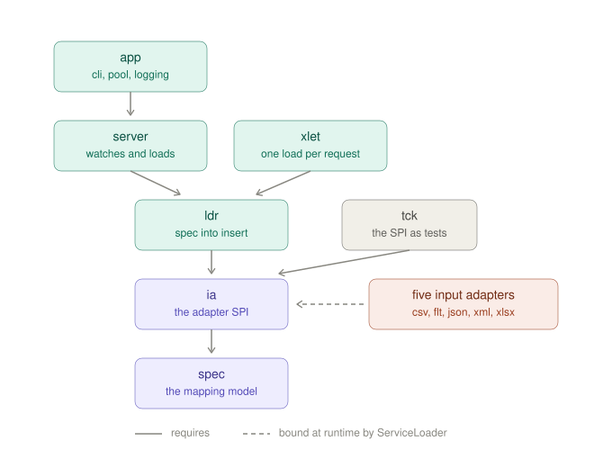

# XLDR

## Project Description

XLDR loads files into database tables from a mapping specification - a document that says what the file looks like
and which value goes in which column, with no code between the two.

It handles CSV, XML, JSON and Excel. It was written for the files that come before those: **a flat file with no
header row, several kinds of record interleaved in it, and a column near the front whose value says which kind each
line is.**

    O,1001,2026-03-01,1
    L,1001,widget,5
    L,1001,sprocket,2
    O,1002,2026-03-02,2

Two record types, two destination tables, one file, and nothing in it that names anything. There are no column
headings for a mapping to refer to, so fields are addressed by position; and the file cannot be read as one shape,
so a spec declares two record selectors and gives each a **discriminator** - which component to look at and what
its value has to be. Both tables are filled in one transaction, so there is no state in which the orders are loaded
and their lines are not.

Files like this arrive daily from mainframes and from partners who settled on a layout decades ago, and the usual
answer is a hand-written pre-processing step that splits the file by record type before anything general-purpose is
allowed near it. That step is where the format knowledge goes to hide. Here it is four lines of the spec - see
[Which records are of a kind](#which-records-are-of-a-kind), or the tutorial's
[pages 4 and 5](docs/tutorial/04-no-header.md), which are early on purpose.

The adapters are JPMS modules bound by the service framework, so the set of formats a deployment understands is the
set of modules on its module path.

> **Pre-1.0.** The API and the mapping-spec format are still settling and may change in any release before `1.0`,
> including in ways that break existing code and existing specs. Such changes are listed in the
> [changelog](CHANGELOG.md) under *Breaking*, but no deprecation period is kept. From `1.0` on, breaking changes will
> be confined to major releases.

## Getting Started

Java 25 or later is required.

### Running the server

Download the distribution from the [latest release](https://github.com/ralfspoeth/xldr/releases/latest) and unpack
it. Java 25 or later is the only requirement - the archive carries the toolkit, the adapters, and JDBC drivers for
H2 and PostgreSQL:

    tar xzf xldr-<version>-dist.tar.gz        # or unzip xldr-<version>-dist.zip
    cd xldr-<version>

For any other database, drop its driver jar into `drivers/` - `ojdbc17` for Oracle, and so on. The two that ship
are the two that are ours to ship; a driver is found by service binding rather than named anywhere, so installing
one is copying a file. There is a note in `drivers/` saying as much.

Or build it from a checkout, which produces the same archive, named after the module that assembled it:

    mvn install
    tar xzf app/target/app-<version>-dist.tar.gz

Create the two tables the file above goes into:

    create table orders(id varchar(10), ordered_on date, customer_id varchar(10));
    create table order_line(order_id varchar(10), sku varchar(30), qty integer);

Then set up a feed - a directory below a root, holding two files: how its files arrive, and what to do with them.

    mkdir -p /var/lib/xldr/orders
    echo 'accepts = glob:*.dat' > /var/lib/xldr/orders/delivery.properties
    cat > /var/lib/xldr/orders/spec.json <<'EOF'
    {
      "input": {
        "mimeType": "text/csv",
        "properties": { "header": "absent" },
        "recordSelectors": [
          { "name": "orders", "discriminator": {"nth": 1, "equals": "O"}, "fieldSelectors": [
              {"name": "id",       "nth": 2},
              {"name": "ordered",  "nth": 3, "type": "TEMPORAL"},
              {"name": "customer", "nth": 4}
          ] },
          { "name": "lines", "discriminator": {"nth": 1, "equals": "L"}, "fieldSelectors": [
              {"name": "order", "nth": 2},
              {"name": "sku",   "nth": 3},
              {"name": "qty",   "nth": 4, "type": "INTEGRAL"}
          ] }
        ]
      },
      "mapping": [
        { "recordSelector": "orders", "table": "orders", "fieldMapping": [
            {"fieldSelector": "id",       "column": "id"},
            {"fieldSelector": "ordered",  "column": "ordered_on"},
            {"fieldSelector": "customer", "column": "customer_id"}
        ] },
        { "recordSelector": "lines", "table": "order_line", "fieldMapping": [
            {"fieldSelector": "order", "column": "order_id"},
            {"fieldSelector": "sku",   "column": "sku"},
            {"fieldSelector": "qty",   "column": "qty"}
        ] }
      ]
    }
    EOF

`header: "absent"` is what says there is no row of names, and it is why the fields count with `nth` rather than
naming a column with `selector`. A headed file is the shorter case, not the starting one: drop the property and
write `"selector": "sku"`.

Point the server at the root and start it; it creates the working directories and picks the feed up. The server
reads `xldr.properties` from the directory it is started in, or from the one `--dir` names:

    printf 'xldr.roots=/var/lib/xldr\njdbc.url=jdbc:postgresql://localhost:5432/xldr\n' > xldr.properties
    bin/xldr                        # this directory
    bin/xldr --dir /etc/xldr        # or that one

A `.dat` file moved into `/var/lib/xldr/orders/in/` is now split by its first column into `orders` and
`order_line`, in one transaction, and filed away under `archive/`. See [Configuration](#configuration) for the full
set of settings, and [Delivering files](#delivering-files) for why the file must be *moved* rather than written in
place.

**Writing the spec is the actual work**, and this README is the reference rather than the path through it. For that,
see the [tutorial](docs/tutorial/README.md). It is thirteen short pages, each adding one thing to the spec built by
the page before: a first spec and the same one in XML, then the headerless pair - counting a file's components
instead of naming them, and separating several kinds of record into several tables - then constants, variables,
lookups, expressions, types and notation, and last, because it needs everything before it, having a language model
draft a spec and knowing what to check. Each page shows whole files rather than fragments, so what you copy is
something you can put straight into a feed.

Those pages are checked rather than trusted. Every build reads them: each spec printed in the tutorial is validated
against the published schema, parsed by the reader that will parse it in anger, and cross-checked against the
record selectors and `create table` statements of its own page - so a page cannot drift from the release without a
test saying so. What needs the real adapters and a database, which is whether a record selector matches anything in
the sample file and what its values parse to, is [`tools/check-tutorial.py`](tools/README.md), run by hand.

### Using the toolkit as a library

The library modules are published to Maven Central under the group `io.github.ralfspoeth.xldr`. Import the `bom` to
fix their versions in one place:

    <dependencyManagement>
        <dependencies>
            <dependency>
                <groupId>io.github.ralfspoeth.xldr</groupId>
                <artifactId>bom</artifactId>
                <version>0.52</version>
                <type>pom</type>
                <scope>import</scope>
            </dependency>
        </dependencies>
    </dependencyManagement>

Then take the loader plus the adapters for the formats you read, without repeating the version; each adapter brings
`ia` and `spec` with it:

    <dependency>
        <groupId>io.github.ralfspoeth.xldr</groupId>
        <artifactId>ldr</artifactId>
    </dependency>
    <dependency>
        <groupId>io.github.ralfspoeth.xldr</groupId>
        <artifactId>csv</artifactId>
    </dependency>

The published modules are annotated for nullness with [JSpecify](https://jspecify.dev): `@NullMarked` at module
level, so every type is non-null unless it carries `@Nullable`. The annotations are compile-only - `requires static`
and `provided` scope - so nothing is added to your runtime; a null checker will read them, and a build without one is
unaffected.

The `bom` manages exactly the published artifacts - `spec`, `ia`, `ldr`, both front ends `server` and `xlet`, and
the adapters `csv`, `xml`, `xlsx`, `flt` and `json` - and deliberately no third-party versions, so importing it does
not bind you to the POI, HikariCP or JDBC driver versions this build happens to use.

`xlet` was not published until 0.36, on the argument that a servlet is a thing to read and adapt rather than to
depend on. That was defensible when it was one class and a `doPost`. It is no longer: it carries a spec registry, a
concurrency limit with its own refusal, statistics behind an MXBean, and the target resolution it shares with the
file server. A deployment that copies all that forks it, and a fork receives no fix anybody makes here - which is
the argument the other way, and now the stronger one. Adapt it if you want to; the source is right there. But
depending on it should be possible, and it is.

`app` and `it` are still unpublished: `app` is the distribution rather than a library, and goes out as a
[GitHub release](https://github.com/ralfspoeth/xldr/releases); `it` is nothing but integration tests.

Both the spec readers and the
adapters are found through `ServiceLoader`, so each need only be on the module path - naming the spec file is enough
to read it, since its name says which format it is in:

    var spec = readSpec(Path.of("/var/lib/xldr/orders/spec.json"));
    int rows = Loader.load(spec, () -> Files.newInputStream(file), Map.of(), connection);
    // one transaction: committed, or rolled back if any mapping failed

That is the whole of loading one input. `Loader.load` finds the adapter for the spec's MIME type, runs every record
mapping over the input, commits, and closes the connection it was given. It is what the file server does with a file
that has arrived and what a web application does with a request body, so it lives in `ldr` rather than in either.

The input is an `InputSource` - openable, not opened - because a spec may carry several record mappings and each is
run over the whole input. A file simply reopens; anything read from a socket has to be spooled somewhere first, and
the interface says so rather than leaving it to be discovered from a load that quietly imported one mapping's worth
of rows.

The pieces underneath remain public for a caller that wants them: `InputAdapterFactory.of(inputSpec)` for the
adapter, and the `Loader` constructor with `loadInput(adapter, in, mapping)` for driving the mappings by hand -
useful when the mappings are not all wanted, or the transaction is not the whole input.

`readSpec` is named to be static-imported, which is how it reads best - `readSpec(specFile)` at the call site, from
`import static io.github.ralfspoeth.xldr.spec.io.MappingSpecReader.readSpec`. `MappingSpecReader.of(Path)` is the
same lookup without the reading, for asking whether a file is a spec this build can read at all; `readSpec` insists,
refusing an unsupported extension with an `IllegalArgumentException` before it opens anything.

Both service lookups - `MappingSpecReader.of` and `InputAdapterFactory.of` - resolve against the class loader that
defined the service rather than the thread context one, and a caller writing its own lookup should do the same. The
one-argument `ServiceLoader.load(Class)` uses the context loader, which a servlet container, a test runner or an
application framework will have set to something of its own; where that loader cannot see these modules the lookup
finds no providers and reports nothing at all.

### Writing an adapter

A format xldr does not ship is a module of its own: implement `InputAdapterFactory` and `InputAdapter`, declare
`provides io.github.ralfspoeth.xldr.ia.InputAdapterFactory with YourFactory` in its `module-info.java`, and put it
on the module path. Nothing else registers it - the jars carry `provides` and no `META-INF/services`, so a module
the graph has not resolved is a module no lookup will find.

The full contract is the package documentation of `io.github.ralfspoeth.xldr.ia`: ten obligations, each with the
reason it exists. Two are worth naming here because they are the ones an implementation gets wrong quietly. A field
delivers the type the spec declared, `TEXT` where it declared none, converted through `Formats.of(properties)` so
that `dateFormat`, `numberFormat` and `locale` mean the same thing in every format - an adapter that returns text
regardless hands the loader a `String` for a numeric column and nothing says so until the insert. And a spec that
cannot be right is refused when the adapter is *built*, not when a file arrives: that is the last moment before a
deployment starts, and a selector this format cannot mean is knowable there.

All ten are checked by the `tck` module, which is what an adapter is held to:

    <dependency>
        <groupId>io.github.ralfspoeth.xldr</groupId>
        <artifactId>tck</artifactId>
        <scope>test</scope>
    </dependency>

```java
class MyConformanceTest extends InputAdapterContract {
    protected InputAdapterFactory factory() { return new MyFactory(); }
    protected String mimeType()             { return "application/x-mine"; }
    protected InputSpec spec()              { return ...; }   // reads the sample below
    protected byte[] sample()               { return ...; }
    protected List<Refusal> refusals()      { return List.of(...); }  // specs you must not build from
}
```

Declare at least one field with a real type in that spec; a spec that is all `TEXT` passes the typing tests without
having been asked anything.

Three obligations need something no kit can invent - a spec your format cannot mean, a record with a value missing,
a record that is broken - so for those the kit does the checking and asks you for the evidence. `refusals()` is
abstract, because an adapter whose author has never been asked what it refuses is the adapter that refuses nothing;
`absences()` and `breakages()` default to empty and skip, naming the obligation that went unchecked in the report.

The snippet above names no `<version>`, which resolves only if you have imported the `bom` as
[shown earlier](#using-the-toolkit-as-a-library). Without the BOM, give the kit the same version as the `ia` you
compile against - which is the rule in general: **the kit's version is the SPI's version.** It is built from the
same revision as every other module and depends on `ia` at exactly that version, so there is no compatibility
matrix, and no question to answer beyond which `ia` you are on.

**Upgrading the kit may turn a green build red, and that is the point.** A conformance kit that can never newly fail
anything has stopped doing its job, so a check may be added, or an existing one tightened, in any release - a minor
one, and after `1.0`. The obligation it checks was already in force in the release you are leaving; what changed is
that something finally looked, and an adapter that goes red was not conforming before the upgrade either. Three of
the five adapters shipped here found that out at 0.51.

This is deliberately not what a minor version usually promises. What a minor *will* keep is the shape of what you
supply: the four methods in the snippet plus `refusals()` are the whole of what an implementer writes, and adding a
sixth stops a subclass compiling rather than failing it - a different kind of interruption, kept for a major and
listed under **Breaking** when it happens, as `refusals()` was at 0.51.

**JUnit's major version is part of the same promise.** The kit is test classes you inherit, so it takes
`junit-jupiter-api` at compile scope and `requires transitive` it - which means depending on the kit pins you to the
JUnit major it was built against, currently 6. Moving to a new JUnit major would break every adapter still on the
old one and staying would block every adapter that had moved, so **a JUnit major bump is an xldr major bump**, on
the same footing as a change to the SPI types. That is the bill for one named failure per obligation appearing in
your own test report, rather than a list of findings you have to render yourself.

## Building and Releasing

### How the modules fit together



Solid arrows point from a module to what it `requires`. Read bottom-up: `spec` is the mapping model and the only
module with no xldr dependency at all, `ia` is the adapter SPI on top of it, `ldr` turns a spec into inserts, and the
two front ends - `server` for a watched directory, `xlet` for an HTTP request - sit on those. `app` is the server as
it is shipped, and adds only what a *runner* decides: a command line, a connection pool, a logging setup.

Each box is a Java module, a Maven artifact and a directory, all under the one name - the arrows are `requires`
edges, and the coordinate is the same word with `io.github.ralfspoeth.xldr:` in front of it.

**The dashed arrow is the interesting one.** The five input adapters appear in nobody's `requires`. `ia` declares
`uses InputAdapterFactory`, each adapter declares `provides ... with`, and JPMS service binding does the rest at
runtime - so `server` and `xlet` each name only `ia` and `ldr` in their descriptors and still read spreadsheets. What
a deployment can read is decided by which adapter modules are on its module path, and by nothing in any source file.
That is why the distribution has a `modules/` directory you can add a jar to, and why adding a sixth format needs no
change to anything in this diagram.

The same seam is what makes an adapter written outside this repository a first-class one: it is on the module path
or it is not, and there is no registry to be added to. Two exist -
[swift-mt](https://github.com/ralfspoeth/swift-mt) and a Bloomberg reply reader - and both are held to the same
contract by `tck`, which is why that module sits beside `ldr` rather than under the adapters: it depends on the SPI,
not on any implementation of it.

Two modules are left out of the picture. `bom` is a bill of materials with no code and so no edges. `it` sits below
everything - its main descriptor requires `server`, `ia` and `ldr`, and its test descriptor additionally requires
`app`, `xlet`, `tck` and all five adapters *by name*, that being the one place adapters are named explicitly, and
only because service binding needs the modules in the graph before it can bind them.

### Modules and building

The whole toolkit is one reactor under the `xldr` parent POM and builds with a single `mvn install`, which orders the
modules by their dependencies:

* `spec`, `ia`, `ldr` - the core: the mapping-spec model and readers, the input-adapter SPI, and the JDBC loader.
  The SPI's artifact, Java module and directory are all `ia`; it was `ia-def` from 0.41 to 0.51, to pair with
  `ia-impl` in a directory listing, and the pair is not worth a second name for the one module every adapter
  depends on;
* `tck` - the input adapter SPI's obligations, as tests. An adapter author extends `InputAdapterContract`, supplies a
  factory and something for it to read, and gets one named test per obligation the kit can check without knowing the
  format. It exists because the obligations were previously only demonstrated - five worked examples in this
  repository, and an adapter written elsewhere against the published interface that kept nine of them and quietly
  dropped the tenth. See the package documentation of `ia` for the full contract, and
  [Writing an adapter](#writing-an-adapter);
* `bom` - a bill of materials fixing the versions of the published modules in one import;
* `ia-impl` - the input adapters, `csv`, `xml`, `xlsx`, `flt` and `json`, each an `InputAdapterFactory` provider
  discovered through `ServiceLoader`. They sit under a parent of their own because they are the one set of modules
  in this build that a deployment picks from - which of them are on the module path is which formats the server
  reads, and `modules/` in the distribution holds exactly these. The parent also declares the three dependencies
  every adapter has, `ia`, `jspecify` and JUnit, so each module states only what makes it that format: POI for
  `xlsx`, Greyson for `json`, nothing at all for the other three. The adapters' own artifacts are unchanged -
  `io.github.ralfspoeth.xldr:csv` and the rest, at the same coordinates as before;
* `server` - the watching and the loading: the `Watcher`, the feed registry, the file processor and the JMX
  statistics. It does not `requires` any adapter; JPMS service binding pulls them into the graph via the `uses` here
  and the `provides` in each adapter, so a deployment supplies the adapter set it needs on the module path. This is
  the module to depend on to embed the server in something else;
* `app` - the server as it is shipped: the command line, the connection pool and the logging setup around `server`,
  plus the distribution. Those are the choices a *runner* makes rather than the server's own, which is why they are
  separate - an embedder brings its own and should not inherit picocli and HikariCP for the privilege. The adapters
  are `provided` dependencies here, so they reach the module path without being bundled into `app`'s own footprint;
* `xlet` - the other front end: one input per HTTP request, loaded through a spec the deployment carries under
  `/WEB-INF/specs/`, for a servlet container. It is a peer of `app` rather than a part of `server` - the request *is*
  the delivery, so nothing there watches a directory or claims a file by moving it - and it reaches the same
  `Loader.load` from the other side, and reports what it has loaded through an MXBean of its own, named after the
  context it is deployed at so that two deployments do not collide. Published since 0.36, having carried enough by
  then that a deployment copying it had forked it; its own README argues both the design and the reversal;
* `it` - integration tests exercising the whole pipeline end to end against a local H2 database, and the only module
  binding failsafe. It depends on `server` and the adapters, and on the two front ends for the tests that drive
  them: `CheckIT` runs the shipped command line from `app` rather than the class behind it, and `XldrServletIT`
  deploys `xlet`'s servlet into an embedded Jetty. Everything else supplies its own `ConnectionSource` as a lambda,
  so what is exercised is the server rather than the way the distribution happens to run it. Tests that need no
  database and no server - where the configuration is looked for, and what is said when it is not there - live in
  `app` and run under surefire.

`revision` is a CI-friendly version property resolved by the `flatten-maven-plugin`, so the installed and deployed POMs
carry the concrete version rather than a literal `${revision}`.

### Distribution

`mvn package` on `app` builds a runnable distribution (`app/target/app-<version>-dist.{tar.gz,zip}`) via the
`maven-assembly-plugin`; the release workflow repacks the same tree as `xldr-<version>-dist`, the name the archive
unpacks to, and changes nothing else about it. Unpacked, it is

    xldr-<version>/
        bin/xldr, bin/xldr.cmd   launchers
        lib/                     the application and the toolkit
        modules/                 the input adapters
        xl/                      the Excel adapter and Apache POI
        drivers/                 the JDBC drivers - H2 and PostgreSQL, plus a note on adding others
        conf/                    sample xldr.properties and logging.properties
        README.md

and runs with

    cd /etc/xldr && /opt/xldr/bin/xldr        # xldr.properties here
    /opt/xldr/bin/xldr --dir /etc/xldr        # or named

**The division is between what has to be there and what a deployment chooses.** `lib/` is the first: remove anything
from it and nothing starts. The other three hold service providers, one directory per kind of choice - which formats,
whether Excel, which database - and the launcher puts all four on the module path. JPMS service binding then resolves
the input adapters (via the `uses`/`provides` of `InputAdapterFactory`) and the JDBC driver (via `java.sql`'s
`uses java.sql.Driver`), so choosing is a matter of moving jars and nothing else: no classpath to edit, no setting to
change. Each of the three may be empty, or absent altogether - choosing none of something is a choice, and a server
with no adapters starts and then refuses to activate any feed, which is loud in the right place.

**Installing your own driver is copying its jar into `drivers/`.** Removing the ones you do not target is the same
operation in reverse. The two that ship are the two that are freely redistributable, which is the whole rule: a
driver that is not - Oracle's, which was in here until 0.40 - is one line of licence taken on in exchange for
saving somebody a download, and it is not a trade worth making for a jar that service binding finds wherever it
comes from.

**`xl/` is Excel, kept apart for weight.** Apache POI brings xmlbeans, curvesapi, several commons libraries and
log4j-api, which together were most of the distribution and made it hard to see what the toolkit is actually made of.
It is named for the format rather than for the library, as `drivers/` is: what a deployment decides is whether it
reads spreadsheets, and POI is how that happens to be done. A deployment that reads none **deletes `xl/` whole**. The
`xlsx` adapter lives in there rather than in `modules/` with the other formats, which is what makes the directory
droppable rather than merely tidy - left among them with its `requires` unsatisfiable, it would stop the JVM before
`main`, since service binding resolves a provider's own dependencies and a missing one is a `FindException` rather
than a quietly absent format.

Nothing in the distribution is compile-time-only. `jspecify` is not shipped: every module declares
`requires static org.jspecify`, which is a claim made to the compiler, and no annotation of it is read at run time.

The launcher takes `java` from `JAVA_HOME` when that is set and from `PATH` otherwise, follows any symlink it was
invoked through - installing `/usr/local/bin/xldr` pointing into `/opt/xldr` works - and checks the JVM is new enough
before starting, so a wrong `JAVA_HOME` is reported as such rather than as an `UnsupportedClassVersionError` naming a
class file version. `JAVA_OPTS` carries extra VM options.

`jlink` is deliberately not used, and the reason has narrowed since it was first written down: HikariCP, picocli and
both SLF4J jars all carry a real `module-info` today, so `lib/` would link. What still would not are **the JDBC
drivers** - PostgreSQL and H2 are automatic modules, as is every other driver, no vendor shipping a real one - and the tail of
POI's dependencies, `SparseBitSet`, `commons-math3` and `curvesapi`. `jlink` refuses an automatic module outright.

That is not a passing inconvenience but the same point `drivers/` and `xl/` are making: which database a deployment
talks to and whether it reads spreadsheets are the deployment's decisions, and an image would have to make both of
them at build time. An image is also built for one platform by the JDK that links it, where this archive runs
wherever there is a JVM. The module-path distribution keeps the modular layout and its service binding intact and
leaves both choices where they belong.

### Releasing

Publishing goes through the Central Portal via the `central-publishing-maven-plugin`, inherited from the `plumbum`
parent. The plugin bundles the whole reactor into a single deployment, so the `xldr` parent POM, the `bom` and the
nine library modules - `spec`, `ia`, `ldr`, `server`, `csv`, `xml`, `xlsx`, `flt`, `json` - are published
together, along with `tck` and the `ia-impl` pom that the five adapters inherit from, which Maven has to be able to
resolve. `app` (an
executable, not a library) and `it` (integration tests) each set `skipPublishing` on the plugin, so they are left
out of the bundle.

A plain deploy therefore publishes everything in one go:

    mvn deploy

or as a tagged release, which additionally builds and tests everything first:

    mvn release:prepare release:perform

`release:prepare` runs `clean verify`, integration tests included, before the tag is cut - that is the gate.
`release:perform` then rebuilds the tagged source, and is configured with `<goals>deploy -DskipITs</goals>` so it does
not run them a second time against source that has just passed. `goals` is the only perform-only setting the release
plugin has: `arguments` and `releaseProfiles` are shared with prepare, and `useReleaseProfile` has defaulted to false
since 3.x. Should a `<site>` ever be added to `distributionManagement`, this override would need `site-deploy` adding
back to it.

Publishing needs a Central Portal user token in `settings.xml` under the server id `central` (generate it at
https://central.sonatype.com/account). `autoPublish` is on, so a valid deployment is released without a manual step.

Loading data from a file into one or more database tables is guarded by a *mapping specification* which comprises an
*input specification* and a *mapping*. The *input specification* tells the engine how to parse a given file and to
load *records* and *fields*. The *mapping* provides - as its name implies - a mapping from records to database tables
and from fields to database columns. The whole input is loaded in one transaction, committed when the file has been
read in full or rolled back entirely if any record mapping fails; the target database itself is configured on the
application, not in the mapping.

The mapping specification can be constructed programmatically or can be provided through some source text in one of the
following formats:

* .json: JSON format
* .xml: well-formed XML complying to a schema described below

A spec may carry more than the members the reader consumes. Anything a reader does not recognise - a JSON member, an
XML element or attribute, at any level - is ignored, so an annotation never breaks a spec; the schemas, being
stricter, name `comment` for exactly that purpose. There are no reserved names: `load` was one until 0.36, held in
case the commit policy it once carried came back, and it is now an ordinary unrecognised member like any other.

### Validating a spec while writing it

Both formats have a published schema, so an editor can check a spec before it ever reaches a server - which otherwise
only reports a broken spec in its log, by leaving the feed inactive. Point at the schema from the spec itself:

    {
      "$schema": "https://ralfspoeth.github.io/xldr/schema/mapping-spec-0.50.json",
      "input": { ... }
    }

    <mappingSpec xmlns:xsi="http://www.w3.org/2001/XMLSchema-instance"
                 xsi:noNamespaceSchemaLocation="https://ralfspoeth.github.io/xldr/schema/mapping-spec-0.50.xsd">

Both are ignored by the readers - `$schema` is just another unrecognised member, and `xsi:` attributes carry no
meaning for a spec that has no namespace of its own. IntelliJ and VS Code both validate and autocomplete from them.

The schemas catch what a schema can: missing or misspelled names, a `type` that is not one of the five, a column
calling a function, a var reading a field - the last two being a matter of which sources each place declares, which
both formats can say - and, in JSON only, a field mapping with no source or with several. The rest is checked when
the spec is read, in particular that every selector compiles. How the feed's files arrive is no longer among them: that moved to
`delivery.properties`, which the server reads and no schema describes, so a spec still carrying `accepts` or
`sentinel` is refused rather than ignored.

The XSD is the more permissive of the two, because XSD 1.0 cannot state the exactly-one rule. Nor can it
allow arbitrary extra elements next to the named ones, so a longer note belongs in an XML comment rather than in an
element of your own.

Annotate a spec with `comment`, which every element and every object takes and both readers ignore:

    { "recordSelector": "people", "table": "person", "comment": "the nightly delivery", ... }
    <mapping recordSelector="people" table="person" comment="the nightly delivery">

The readers ignore any member or attribute they do not know, but the schemas name this one and go on refusing the
rest - because further down a spec an unknown name is far more often a misspelling than a note. `fieldSelector`
written for `fieldSelectors` costs a record every one of its fields, and no reader will say so: ignoring the
unknown is exactly what it promises.

A schema is published whenever the format changes, and is named after the release that changed it:
`mapping-spec-0.50` describes the format from 0.50 onwards,
`mapping-spec-0.47` that of 0.47 to 0.49,
`mapping-spec-0.46` that of 0.46,
`mapping-spec-0.44` that of 0.44 and 0.45,
`mapping-spec-0.43` that of 0.43,
`mapping-spec-0.42` that of 0.42,
`mapping-spec-0.40` that of 0.40 and 0.41,
`mapping-spec-0.35` that of 0.35 to 0.39,
`mapping-spec-0.32` that of 0.32 to 0.34,
`mapping-spec-0.23` that of 0.23 to 0.31,
`mapping-spec-0.21` that of 0.21 to 0.22,
`mapping-spec-0.13` that of 0.13 to 0.20,
`mapping-spec-0.10` that of 0.10 to 0.12, and so on. An
earlier one stays where it is, so a spec pinned to it keeps validating.

What a schema cannot see is whether the spec makes sense as a whole - whether a mapping names a record selector the
input actually declares, or whether the adapter accepts the selectors. There was a `bin/xldr validate` for that,
removed in 0.30, because the checks worth having had migrated one by one to the places that know: an adapter refuses
a selector naming no column of the file it is reading, a feed that cannot activate says why, and `xlet` refuses to
deploy at all with a spec it cannot load. Each of those is earlier than a command, or better informed, and none of
them can be forgotten.

What went with it was one check nothing else makes - a CSV record selector given a discriminator although the file
has a header, which is legal and usually a mistake - and it went because *usually* is the problem: a headed file may
perfectly well carry a type column whose values are what the discriminator selects on. In 0.32 that stopped being a
grey area at all: a discriminator may name the component it tests, so a headed file with a type column is what the
feature is *for*.

### Checking a draft against the database and a sample

    xldr check spec.json --sample orders.csv --url jdbc:postgresql://host/db --user dbuser --password

This is not the old `validate` returning. That one repeated what the adapters do; this asks the question none of
them can, because it holds three things at once that no part of a running server ever does - the spec, a real file,
and the target table. The adapter has the first two and knows nothing about the table. The loader has the first and
the third, but only once a file is being loaded and a transaction is open. So what is left over is exactly this:

- a mapping naming a record selector the input never declared, which the adapter refuses on the first delivery;
- a `column` the table has not got, which is a SQL error on the first insert;
- a `lookup` whose reference table, returned column or key column is not there, which fails on the first record -
  and, where the lookup is in a `var`, before a single record has been read;
- a record selector that is well formed and matches nothing in a file you call representative, which nothing
  refuses at all - the load succeeds and inserts no rows.

Each argument is optional except the spec: without `--url` the database is not consulted, without `--sample` the
file is not read, and a check with neither still cross-checks the spec against itself.

It reads only. The connection is opened to ask `DatabaseMetaData` what the table holds, and the sample is parsed in
memory, so it is safe to point at production if that is the only place the table exists.

`--rows N` prints the first N parsed records of each record selector with their Java types, and this is the half no
check can do for you:

    'customers'  -> customer: 2 record(s) matched
        id=1 (Long)  name=Alice (String)  since=2026-03-01T00:00 (LocalDateTime)  balance=1234.56 (BigDecimal)

These are the *field selectors* - what the file gives - and not what would be inserted. A constant, a `var`, an
`expr` or a lookup's result does not appear, because evaluating those is the load rather than a reading of the
file: an expression needs the ambient values a feed supplies, and a lookup needs to query. A lookup's *key* does
appear, that being a field selector like any other.

For the other half, `check` prints the mapping plan - where each target column's value comes from:

      customer <- 'customers'
          id           field     id
          name         field     name
          source_cd    var       src
          loaded_from  expr      ${xldr.filename}
          region_id    lookup    region.id where city = field name

Nothing is evaluated here either, and deliberately: working out what an expression comes to would be a second
implementation of the loader's engine, one that could disagree with it. What it gives you is the wiring in one
place. A spec spreads forty columns over a hundred lines with each source nested inside its own object, so *where
does this column come from* is a question the document does not answer anywhere - and a column wired to the wrong
source validates, loads, and is wrong in every row.

Two specs can also be compared, which is what a transliteration between the formats needs:

    xldr check spec.json --same-as spec.xml

Both are read into the same in-memory form, so the comparison is equality; where they part company it says which
record selector, var or mapping differs and shows both.

Within that, nothing shown is an error and nothing could be: a date read under the wrong pattern is still a date,
and a German decimal read as a plain one is still a number. But the file said `01.03.2026` and `1.234,56`, and one
look at the line above says whether `dateFormat` and `locale` were understood the way the producer meant them. That
is the failure this toolkit is otherwise worst at catching, and it costs a row that is silently wrong rather than a load
that stops.

Reading different file types is supported by providing a specific adapter per MIME type. There may be more than one
adapter per MIME type on the module path; it's then however unspecified which one will be selected. A future enhancement
will allow require features to be implemented by the adapter. The adapters shipped with the toolkit are

| MIME type                                                                                       | Adapter | Input                                                 |
|-------------------------------------------------------------------------------------------------|---------|-------------------------------------------------------|
| `text/csv`                                                                                      | `csv`   | separated columns, with or without a header row       |
| `text/xml`, `application/xml`                                                                   | `xml`   | XML, selected with XPath                              |
| `application/vnd.ms-excel`, `application/vnd.openxmlformats-officedocument.spreadsheetml.sheet` | `xlsx`  | Excel, both `.xls` and `.xlsx`                        |
| `text/plain`                                                                                    | `flt`   | fixed length records, addressed by character position |
| `application/json`, `text/json`                                                                 | `json`  | JSON, selected with Greyson pointers                  |

Selecting records and fields depends on the type and structure of the input file. An adapter has to provide
implementations for *record selectors* and *field selectors*.

A *mapping* maps records, identified by the name of the record selector, to one or more database tables. A record maybe
mapped multiple times. Each mapping of a record to database table contains a field mapping that maps the fields of a
record to a database column.

## Implementation Details

### The Input Specification

An input specification contains the following pieces of information:

* the MIME type, which selects the adapter;
* record selectors, each of which
    * is identified by a name,
    * says which records are its own - a `selector` for an input that has to be *pointed at*, or a
      [`discriminator`](#which-records-are-of-a-kind) for a flat one where every line is a candidate. Both are
      optional, and neither is written where the whole file holds one kind of record, as in a CSV with a header or a
      fixed-length file. No record selector carries both: no input is read both ways, and an adapter that locates
      its records refuses a discriminator by name rather than proceeding without it;
    * has related field selectors, which in turn
        * are identified by a name, distinct within that record selector - a mapping refers to a field by this
          name, so two of them cannot share it and a spec that repeats one is refused,
        * say where the value sits - a `selector` or an [`nth`](#where-a-value-sits), exactly one of the two,
        * and, optionally, a [data type](#field-types);
* optionally [variables](#variables), values computed once per load;
* optionally `properties`, the [settings of the adapter](#feed-configuration) the MIME type selects.

### Where a value sits

A field says it in one of two ways, and exactly one.

A **`selector`** is the adapter's own syntax: an XPath for XML, a character range for a fixed-length file, a pointer
for JSON, a cell reference for a spreadsheet, the name of a column for CSV.

An **`nth`** counts, from one. It is *the n-th component of the record the record selector identified*, and each
adapter only has to say what its records are made of:

| input | the n-th component |
|---|---|
| CSV, TSV | the n-th field of the line |
| Excel | the n-th column of the record's **range**, counted from the range's own first column |
| JSON | the n-th element, where the record is an array |
| XML | the n-th child element |
| fixed length | nothing - a fixed-length record has offsets and no components, so `nth` there is refused |

    { "name": "id", "selector": "id" }        <fieldSelector name="id" selector="id"/>
    { "name": "id", "nth": 1 }                <fieldSelector name="id" nth="1"/>

**Two names rather than one attribute of two types**, because the XML format cannot express the second: an attribute
is text, `selector="3"` is the only thing writable, and a reader deciding by *looks like a number* would have kept
exactly the ambiguity this removes - while a header that really does name a column `3` makes the guess wrong. Two
names cost nothing and let both schemas type `nth` as an integer, so `nth="first"` is refused before any adapter sees
it. And **not** `column`: a field *mapping* has always used that word for the database column it writes to, and the
two would have sat a line apart meaning opposite ends of the same value.

Where the *data* has no n-th component - a JSON record that turns out to be an object, which is unordered by
specification, or a line with fewer fields than that - the value is `null`, because only the data could have said so
and the next record may differ. Where the *format* has none, the spec is refused when the adapter is built, the spec
alone having proved it wrong.

Example:

    "input": {
        "mimeType": "text/xml",
        "recordSelectors": [
            {
                "name": "xx",
                "selector": "//xx",
                "fieldSelectors": [
                    {
                        "name": "id",
                        "type": "TEXT",
                        "selector": "@xxid"
                    }
                ]
            },
            {
                ...
            }
        ]
    }

### Field types

A field selector's `type` is one of `TEXT`, `INTEGRAL`, `FP`, `DECIMAL` or `TEMPORAL` (matched case-insensitively),
and decides the Java type the adapter delivers and therefore what the loader binds: `String`, `Long`, `Double`,
`BigDecimal` and `LocalDateTime`. It is optional; a field without one is read as text. The names are none of Java's
on purpose, so that `FP` is not read as `float` nor `INTEGRAL` as `int`, and so that the choice between `FP` and
`DECIMAL` - rounding or exact - is the one the reader is asked to make. They are none of SQL's either, which is why
`TEMPORAL` is not called `DATE`: it carries a time of day and binds as `TIMESTAMP`, so the old name - used until
0.47 - promised the one SQL type it is not. A spec still saying `DATE` is refused when it is read.

Values are read in their canonical form: an ungrouped literal such as `1234.56` for the numeric types, ISO-8601 for
`TEMPORAL` - a plain date (`2026-07-22`) as well as a timestamp (`2026-07-21T14:30`), a plain date being midnight of that
day. Surrounding whitespace is stripped, so a padded fixed-length column or an indented XML element needs no special
handling, and **a value that is blank is absent**: it becomes `null` and the loader binds SQL NULL. That holds for the
numeric types too, where a blank column is a missing value rather than a zero or a parse error.

Input in another notation is a property of the feed rather than of the mapping, and is configured on the adapter with
`dateFormat`, `numberFormat` and `locale` - see [Feed configuration](#feed-configuration).

### Variables

Alongside the record selectors, an input may declare `vars`: named values evaluated **once per load** and then
referenced from any field mapping by `{"var": "name"}`. A value looked up from a reference table is read a single
time and stamped onto every row of every table in the file, rather than re-resolved per row; a constant can be named
once and reused across mappings.

A var is row-independent by construction, so its source is a `constant`, an `expr`, a `lookup`, an `fn`, a `regex`,
or another `var` declared earlier - never a `fieldSelector`, at any depth: not as the source, not as a lookup's key,
not as an argument to a call, not as what a pattern is matched against. Vars are evaluated in declaration order.

    "input": {
        "mimeType": "text/csv",
        "vars": [
            {"name": "source", "constant": "PD"},
            {"name": "batchId", "lookup": {"table": "load_batch", "column": "id",
                                           "keyColumn": "feed", "constant": "funds"}}
        ],
        "recordSelectors": [ ... ]
    }

    "mapping": [
        {
            "recordSelector": "rows",
            "table": "t",
            "fieldMapping": [
                {"var": "source",  "column": "source_cd"},
                {"var": "batchId", "column": "batch_id"}
            ]
        }
    ]

### Calling a function

An `fn` source calls a function in the target database. It is a **var source only**:

    "vars": [
        {"name": "loadId", "fn": {"name": "pkg_load.next_id", "type": "INTEGRAL",
                                  "args": [{"constant": "funds"}]}}
    ]

    <var name="loadId">
        <fn name="pkg_load.next_id" type="INTEGRAL">
            <arg constant="funds"/>
        </fn>
    </var>

and a column reaches the result the way it reaches any var, with `{"var": "loadId"}`.

**Why only a var.** A var is evaluated once per load, a column bound once per record, so the same call in a field
mapping would be a round trip a row - for a sequence, a batch number or a run id, which are drawn once by nature.
Both halves of that rule are enforced where they can be seen rather than where they break: a var refuses a
`fieldSelector` at any depth and a field mapping refuses an `fn` at any depth, so a spec saying either is refused
when it is read rather than on the first file after it is deployed.

The call goes out as JDBC's `{? = call name(?)}` escape through a `CallableStatement`, and `type` says what the OUT
parameter is registered as - hence required, where a field selector's `type` may be left out and defaults to `TEXT`:
the parameter is registered before the call, so there is nothing left to infer it from. The five types are the same
five as everywhere else.

`name` is one or more identifiers separated by dots and nothing else. It is the only part of a value source that
reaches the text of a statement - everything a spec otherwise contributes is bound as a parameter - so it is held to
being a name. A spec with a call in it therefore depends on the target **schema**, in that the function has to exist
there, exactly as a `lookup` already depends on a table existing. It still depends on no **dialect**: no spec carries
SQL.

Each argument is a value source in its own right, so an argument may be a constant, a var, an expression, a lookup, or
another call, and nesting costs nothing:

    {"name": "batch", "fn": {"name": "open_batch", "type": "INTEGRAL", "args": [
        {"var": "feed"},
        {"fn": {"name": "today", "type": "TEMPORAL"}}
    ]}}

`args` left out is a call with none. A call may return null and nothing fails for it: a function saying "no such
thing" by returning nothing is saying something a loader has no business overruling, and the same now goes for a
`lookup` whose key matches no row.

### Expressions

An `expr` source is a `${...}` template, evaluated in the JVM and bound as a parameter - it never emits SQL. It is
interpolation plus a small set of functions, with no operators. Each `${...}` hole is either a name or a function
call, and adjacent holes concatenate:

    {"name": "generatedId", "expr": "${xldr.filename}-${nextval('doc')}"}
    {"expr": "${now()}",             "column": "loaded_at"}
    {"expr": "${nextval('rownum')}", "column": "line_no"}

the first as a `var` in the input, the other two as field mappings.

A **name** resolves in order: the two reserved prefixes `${xldr.*}` for what the application knows about the load
(currently just `xldr.filename`) and `${env.*}` for what the deployment supplies (see
[Deployment values](#deployment-values)), then a declared `var`, then - in a field mapping - a field of the record.
The prefixes are reserved rather than merged into that order on purpose: an unprefixed ambient name placed ahead of
the fields would silently shadow a column of the same name in every row, and placed behind them would be invisible in
exactly the mappings that have a record in scope. The **functions** are:

* `nextval('name'[, start[, inc]])` - the next value of an in-memory sequence that lives for the one load, shared by
  name. The first draw is `start` (default 1), each later one adds `inc` (default 1). Sequences never touch the
  database;
* `now()` - the current instant (`java.time.Instant`);
* `format(value, 'pattern')` - a date or timestamp as text, in the pattern language of `DateTimeFormatter`. An
  instant is rendered at the JVM's zone, having none of its own;
* `parse(text, 'pattern')` - the reverse: a date or timestamp read from text in a notation no adapter recognises, for
  the one column that needs it rather than for the whole feed the way the `dateFormat` property does. What the
  pattern reads decides the type - a date and a time give a `LocalDateTime`, a date alone a `LocalDate`, a time alone
  a `LocalTime`.

An argument may itself be a name or a call, so `${format(now(), 'yyyy-MM-dd')}` and `${format(birthdate, 'yyyy')}`
both say what they look like; a name inside a call is resolved exactly as `${name}` would be, fields included. A null
value formats to null, so an absent date stays a SQL NULL rather than becoming the text `null`.

**Typing:** a template that is a single hole keeps that value's native type - `${nextval('r')}` binds an integer,
`${now()}` a timestamp, `${format(now(), 'yyyy')}` a string; anything with literal text or several holes concatenates
to a string.

An `Instant` is not one of the `java.time` types JDBC 4.2 requires a driver to accept - an instant carries no calendar
to write into a column - so the loader binds it as an `OffsetDateTime` at the JVM's zone. Without that, Oracle rejects
`${now()}` outright, whatever the target column is. Against a *text* column the driver then renders the timestamp its
own way, which under Oracle follows the session's NLS settings rather than ISO-8601 - so where a timestamp goes into a
text column, `${format(now(), 'yyyy-MM-dd HH:mm:ss')}` says what will be stored, and nothing else does.

Where it is used decides how often it runs: as a `var` it is evaluated **once per load** (one generated id for the
whole file, one sequence draw); as a field mapping it is evaluated **per row** (so `${nextval('rownum')}` numbers the
rows). A `var` expression has no record in scope, so it may not reference a field.

### Taking part of a value

Sometimes the value wanted is inside another one. A feed delivering `prices_EUR_20260101.csv` carries its currency
in the name of the file and nowhere else; a product code has the year in characters 4 to 7. A `regex` picks it out:

    {"name": "currency",
     "regex": {"pattern": ".*_([A-Z]{3})_.*", "group": 1, "expr": "${xldr.filename}"}}

    <regex pattern=".*_([A-Z]{3})_.*" group="1" expr="${xldr.filename}"/>

Three parts, and the third is the interesting one:

* `pattern` - a regular expression in [`java.util.regex`](https://docs.oracle.com/en/java/javase/25/docs/api/java.base/java/util/regex/Pattern.html)
  syntax. It is applied with `find`, so it matches anywhere in the value unless it is anchored;
* `group` - which capturing group to take. Optional, and `0` - the whole match - which is what a pattern written to
  match exactly what is wanted needs;
* **the subject**, written on the regex itself exactly as it would be written on the field mapping. Above it is an
  `expr`; it could as well be a `fieldSelector`, a `constant`, a `var`, or - in a var - a nested `lookup` or `fn`.

**A pattern that does not match yields NULL**, and so does a subject that is null. This is the same answer a lookup
gives for a key that matches no row, and for the same reason: one file whose name does not fit the pattern should
not fail a delivery of a hundred thousand records. The gap is in the data, where it can be reported on.

**The pattern is compiled when the spec is read.** A regex that does not compile, or a `group` the pattern does not
capture, is refused there - so a feed is activated only if its patterns compile, and the mistake lands on the person
editing the file rather than on the first delivery.

Where it is used decides how often it runs, as with an expression: in a `var` it is applied **once per load**, in a
field mapping **per row**.

Two things it may not do. A var's regex may not read a `fieldSelector`, there being no record in hand - the rule
every value source in a var obeys. And a *column's* regex may not read a `lookup`: a regex runs in the JVM, on a
value bound as a parameter, and a column's lookup is a subquery of the insert whose value does not exist until the
statement runs. In a var the same spelling is fine - the lookup is one query and the pattern is applied to what came
back - so read the lookup into a var and match against that, or do the matching in the view the lookup reads.

### After the load: transforms

A spec may end with `transform`, a list of procedures called once each after every mapping has run:

    "transform": [
        {"name": "pkg_load.close_batch", "args": [{"var": "batch"}, {"expr": "${xldr.rowsLoaded}"}]},
        {"name": "reconcile"}
    ]

    <transform name="pkg_load.close_batch">
        <arg var="batch"/>
        <arg expr="${xldr.rowsLoaded}"/>
    </transform>
    <transform name="reconcile"/>

They run in the order written, on the load's own connection, **after the last record and before the commit**. So a
procedure sees the rows this load inserted and nobody else does yet, and a procedure that throws rolls the whole
file back - the load stays one unit of work rather than becoming a load plus an afterthought. If you want something
that cannot fail a file, it does not belong here; put it downstream of the commit, where a failure is somebody
else's to retry.

**Not a value.** `fn` gets you something back and belongs to a var; `transform` gets you nothing back and belongs
to the spec. That is why a `ProcedureCall` is not a `ValueSource` and carries no `type` - there is no OUT parameter,
and `{call name(?)}` is the whole statement. A spec that wants a number out of the database wants a var with an
`fn` in it.

Arguments are the sources a var may have - a constant, a var, an expression, a lookup, another call - and never a
`fieldSelector`, at any depth, because the records are gone by then. A `var` argument is the value the var was given
at the **start** of the load: the batch a transform closes is the one the load opened.

`${xldr.rowsLoaded}` is available to an expression here and nowhere else. It is the first ambient value the loader
supplies rather than the application - the count is the one thing about a load that nobody can pass in beforehand -
and it is deliberately unavailable in a field mapping, where mid-file there is no such number and the name is
therefore unknown.

`xldr check` lists the transforms it found and looks each procedure up in the database's metadata, as it does for
an `fn`.

### Committing

The whole input is one transaction: the loader commits when the file has been read in full, or rolls everything back
if any record mapping or any transform fails - all or nothing. This keeps the file the unit of work, so a failed load
leaves the target tables untouched and the file can be corrected and retried.

Which database is fed, and how it is pooled, is configured on the application rather than in the mapping - see
[Configuration](#configuration). No connection information lives in the spec, so the same mapping can be promoted from
test to production unchanged.

### Loading twice

**XLDR inserts. It does not merge, and this is deliberate.** A mapping has no notion of a natural key, so a file
loaded twice is loaded twice. What the loader guarantees is narrower and more useful than it first appears, and
what it leaves alone is left alone on purpose.

**What it guarantees.** A load is one transaction over the whole file. A failed load leaves the tables exactly as
they were, so *retrying a file that failed* is always safe - which is the idempotency that matters operationally,
because that is the case that actually happens at three in the morning. What is not safe is loading a file that
already succeeded.

**Why it stops there.** The target is a **landing zone**, and what happens next is the application's business:
either it knows how to ingest what has landed, or a stored procedure merges or replaces it. That boundary is where
it belongs, because merging needs things a mapping spec does not and should not know - which columns form the
natural key, whether a row is versioned or overwritten, what a soft delete looks like, whether a late correction
supersedes an earlier record or sits beside it. Expressing that in a spec means the format growing a key language,
then a conditional, then an ordering; and a configuration format that grows those has become a programming language
with none of the tools. The database already has one, and it is better at this.

So the division is: XLDR is responsible for the contents of the file arriving faithfully, completely and in one
transaction. Everything about what those rows *mean* against what is already there belongs downstream.

**What a landing table wants.** Three columns make the downstream job possible, and this is where the sources on a
field mapping stop being decorative:

    {"expr": "${xldr.filename}", "column": "loaded_from"},
    {"var": "loadedAt",          "column": "loaded_at"},
    {"var": "batch",             "column": "batch_id"}

The filename identifies the delivery, the timestamp orders two deliveries of the same name, and a batch number -
a [variable](#variables), so it is drawn once per load rather than once per row - groups the rows a merge should
consider together. Without at least the first, a landing table cannot answer "where did this row come from", and
neither can anyone reconciling it.

**Refusing a redelivery, if you want that.** Since a load is one transaction and a record mapping may cap itself
with `limit`, the same record selector can feed a control table exactly once per file:

    {"recordSelector": "customers", "table": "load_control", "limit": 1, "fieldMapping": [
        {"expr": "${xldr.filename}", "column": "filename"},
        {"var": "loadedAt",          "column": "loaded_at"}
    ]}

Put a unique constraint on `load_control.filename` and a second delivery of the same name fails on that insert,
which rolls the whole load back and sends the file to `hospital/` with the constraint violation beside it. A
duplicate load becomes a refusal rather than duplicated rows - the same trade this toolkit makes everywhere else,
and available without any support from the spec format. Whether a repeated filename really means a repeated
delivery is a question about your producer, which is why this is a pattern here rather than a feature.

### The Record Mapping Specification

The record mapping specification is an array of record mappings, each naming a record selector from the input
specification, the target table, and an array of field mappings from a source to a target column. Every field mapping
carries exactly one of these sources:

* `fieldSelector` - a field of the record, resolved by the adapter and bound as a parameter (the ordinary case);
* `constant` - a fixed value from the spec, bound as a parameter. In JSON its type follows the literal (string, number,
  boolean), and `null` loads a SQL NULL; in XML, an attribute, it is always a string and there is no way to write a
  null;
* `lookup` - a value read from a reference table, emitted as an inline scalar subquery
  `(select column from table where a = ? and b = ?)`. It matches on one column or on several; each condition's value
  is itself a `fieldSelector`, `constant`, `var` or `regex`, and a key that matches no row, or any condition whose
  value is null, yields NULL;
* `var` - a reference by name to an input [variable](#variables), bound as a parameter;
* `expr` - a [`${...}` template](#expressions) evaluated in the JVM, bound as a parameter;
* `regex` - [part of another value](#taking-part-of-a-value), picked out by a regular expression in the JVM and
  bound as a parameter.

Every value reaches the database as a bound parameter or a normalized identifier; a spec never contributes raw SQL.

A record mapping may also carry a `limit`, the maximum number of records inserted for it.

A lookup example - translate an ISO code carried in the input to a surrogate key:

    {
        "lookup": {
            "table": "country",
            "column": "id",
            "keyColumn": "iso",
            "fieldSelector": "country_code"
        },
        "column": "country_id"
    }

The two `column`s are at different levels and mean what their level says: the inner one is the column read *from* the
reference table, the outer one the column of the target table written *to*.

**A composite key is written as `conditions`**, one entry per column, and they are `and`ed in the order written:

    {
        "lookup": {
            "table": "rate",
            "column": "factor",
            "conditions": [
                {"column": "ccy",  "fieldSelector": "currency"},
                {"column": "asof", "var": "valueDate"}
            ]
        },
        "column": "rate_factor"
    }

    <lookup table="rate" column="factor">
        <conditions>
            <condition column="ccy" fieldSelector="currency"/>
            <condition column="asof" var="valueDate"/>
        </conditions>
    </lookup>

`keyColumn` beside a source is the one-condition spelling and stays exactly as it was - a lookup on a single column
reads better said once than wrapped in an array of one. A lookup writes one form or the other, never both.

**No conditions at all is a lookup of the whole table** - a single-row view, or Oracle's `dual`:

    {"lookup": {"table": "current_rate", "column": "factor", "conditions": []}}
    <lookup table="current_rate" column="factor"><conditions/></lookup>

It has to be written rather than implied. A lookup that says neither `keyColumn` nor `conditions` is refused, so
that forgetting a key stays an error instead of quietly becoming an unconditional read that stamps one arbitrary
row onto every record. That an unconditional lookup takes an arbitrary row where the table has several is not a
new hazard: a key matching several rows does the same, and always has.

The order matters more than `and` being commutative suggests: it is the order of the `where` clause and therefore of
the bound parameters, so it is kept as written rather than left to a hash map. Two conditions on one column are
refused, compared the way SQL compares them - `ccy` and `CCY` are one unquoted column, and matching on it twice is
not something a spec means to say.

Example:

    "mapping": [
        {
            "recordSelector": "xx",
            "table": "tab_xx",
            "limit": 1000,
            "fieldMapping": [
                { "fieldSelector": "id", "column": "col_id" },
                { "constant": "PD",      "column": "source_cd" }
            ]
        },
        ...
    ]

A mapping specification as a whole is therefore an `input` and a `mapping`:

    {
        "input": { ... },
        "mapping": [ ... ]
    }

The order of the elements is unspecified.

### The XML Format

The same specification in XML. Everything is carried in attributes and the element and attribute names are those of
the JSON format, so a spec can be transliterated between the two without renaming anything. What is optional in JSON
is optional here.

    <mappingSpec>
        <input mimeType="text/xml">
            <properties ns.f="http://example.com/funds" dateFormat="dd.MM.yyyy"/>
            <var name="source" constant="PD"/>
            <recordSelector name="fund" selector="/root/fund">
                <fieldSelector name="id" selector="@id" type="TEXT"/>
                <fieldSelector name="nav" selector="nav" type="DECIMAL"/>
            </recordSelector>
        </input>
        <mapping recordSelector="fund" table="snmandat" limit="1000">
            <fieldMapping fieldSelector="id" column="ident1_txt"/>
            <fieldMapping var="source" column="source_cd"/>
            <fieldMapping expr="${xldr.filename}" column="loaded_from"/>
            <fieldMapping constant="X" column="status_cd"/>
            <fieldMapping column="country_id">
                <lookup table="country" column="id" keyColumn="iso" fieldSelector="c"/>
            </fieldMapping>
        </mapping>
    </mappingSpec>

A value source is one attribute of a `fieldMapping` - `fieldSelector`, `constant`, `var` or `expr` - except for the
three that are child elements: a `<lookup>`, which carries its own source attribute for the key; an `<fn>`, which is
a child of a `<var>` and carries one `<arg>` per argument; and a `<regex>`, which carries its `pattern` and `group`
as attributes and its subject the way whatever holds it would. An `<arg>` carries exactly what a
`<fieldMapping>` carries, minus what a var may not say, which is what lets an argument be a nested `<lookup>`,
`<fn>` or `<regex>`. A constant in XML
is always a string, since an attribute has no type of its own; the `null` a JSON spec can write has no XML form. Where
a column must be given a NULL from an XML spec, leave the mapping out - an unmapped column keeps whatever default the
table gives it.

## The Server

The application runs as a server watching a number of configured *roots*. A root is the only place in which feeds may
be created; a feed is a directory exactly one level below a root that contains a mapping spec.

    <root>/<feed>/
        delivery.properties how files arrive; its presence makes the directory a feed
        spec.json           one of spec.json | spec.xml; what to do with what arrives
        target.properties   optional; the schema and catalog the rows go to
        env.properties      optional; what this deployment supplies to the spec
        in/                 producers move input files in here
        work/               claimed, currently being loaded
        archive/2026/07/22/ loaded successfully
        hospital/           failed, together with an error log

Creating a feed is `mkdir` plus two files; the four working directories are created by the server. The two have
different owners and need not arrive together. `delivery.properties` is what makes the directory a feed: with it alone
the feed is real - its directories exist and its producer may deliver - but nothing is loaded, and what arrives waits
in `in/` until a spec appears, at which point the backlog is loaded without being delivered again. A feed in that state
says so once in the log, at WARNING, rather than every scan.

Removing the spec deactivates the feed, replacing it reloads it - and the same goes for the delivery file, since
changing which files a feed claims is no more structural than changing a selector. No restart in either case. Exactly
one spec file must be present: two of them is refused rather than resolved by precedence, because loading through the
wrong spec is worse than not loading at all.

#### `target.properties`: where the rows go

The dual of `delivery.properties`. One says how a feed's files arrive, the other where their rows land, and both are
properties of the deployment rather than of the mapping - which is why neither is in the spec. A spec is meant to
travel from test to production unchanged, and the schema it writes into is exactly the sort of thing that differs
between the two.

    schema  = staging
    catalog = warehouse

Both settings are optional, and so is the file. Without it, table names go to the database as the spec wrote them
and resolve through whatever search path the connection already has - which is how most deployments work and how
every one worked before this existed. Naming a schema matters where the search path is not enough: a service
account that can see several, or a staging schema fed by the same specs that feed production.

The schema qualifies the `insert` and every `lookup` select alike, since a reference table a spec names without
qualification lives wherever the feed's tables live. Each part is folded like any other identifier, so `staging`
and `STAGING` are one schema and a quoted `"My Schema"` keeps its case.

**Not every database takes both.** Before the first record is read, the driver is asked whether a catalog and a
schema may appear in data manipulation at all, and one it will not take is refused there and then:

    this deployment names a catalog, warehouse, but PostgreSQL does not take a database in an
    insert. Remove it from target.properties

PostgreSQL is the case that matters - it cannot qualify across databases, so `catalog` is never usable against it,
and Oracle has no catalog worth the name either. Asking first turns a driver syntax error on the first record of
the first file into a sentence before the file is claimed. The separator is always `.`: JDBC has no notion of a
schema separator, that being fixed by the SQL grammar rather than by a dialect, and `getCatalogSeparator` only
means anything alongside `isCatalogAtStart` - which every driver shipped here answers the same way.

A setting this file does not know is refused rather than ignored, and the reason is sharper than for
`delivery.properties`: a misspelled `schmea` would leave the load unqualified, and an unqualified load against a
search path that happens to find a table of the same name *succeeds* - into the wrong schema, with nothing said.

The three files are read per load, not cached on the feed, so editing one reaches the next file without the feed
being reloaded.

Deactivating takes effect for files as well as for the feed: a file already sitting in `in/` when the spec goes is
left there untouched, and so is a marker beside it. A load in flight when the spec is removed does run to the end -
it is a transaction, and abandoning it halfway is not an improvement - but nothing new is started. Switching a feed
off is therefore something an operator can rely on rather than a race against whatever is in the directory.

### Deployment values

A spec is meant to travel from test to production unchanged, so anything that must differ between the two cannot be in
it. A feed may therefore hold an optional `env.properties` beside its spec, and every key in it becomes an expression
name under the `env.` prefix:

    # <root>/prices/env.properties
    mandant  = 4711
    currency = CHF

    {"expr": "${env.mandant}",  "column": "mandant_nr"}
    {"expr": "${env.currency}", "column": "waehrung_cd"}

The same spec then loads under a different client number on the test box without being edited, which is the point.
This is not a second home for what the spec could say itself: how to *read* the file - separators, formats, selectors -
belongs in the spec and is the same everywhere, and putting it here instead only splits one description across two
files.

The file is read once per loaded file rather than cached with the feed, so an edit reaches the next load with no
reload in between. Having none is normal and silent; a spec that names an `env.` value the file does not supply fails
that load with the name it could not resolve, and the input goes to the hospital. Values are always text, so a
non-text column relies on the driver coercing, or on `parse(...)`.

Two things it is not for. **Secrets**: the database credentials live in `xldr.properties` outside the watched tree
precisely so that nobody who can drop a file into a feed can read them, and `env.properties` is inside it. **Adapter
properties**: `input.properties` is consumed when the adapter is built, before any expression is evaluated, so `env.`
cannot reach it.

### Delivering files

A file must not be read while it is still being written. The server does not guess at this with size or timeout
heuristics - the producer states when a file is complete.

This is deployment rather than mapping - which names a producer uses, and whether it writes a marker, differs between
test and production while the mapping does not - so it lives in the feed's `delivery.properties` and not in the spec:

    accepts = glob:*.csv

Each feed declares **exactly one** of two delivery rules, `accepts` or `sentinel`. A delivery file with both, with
neither, or with a key the reader does not know is refused, and the directory is then not a feed at all: its working
directories are never created, so a producer pointed at it finds nowhere to deliver rather than a hole that swallows
files. Unknown keys are refused rather than ignored because a properties file has no schema, and a misspelled
`acccepts` would otherwise leave a feed claiming nothing with nothing to say about why.

Both patterns are passed straight to Java's `FileSystem.getPathMatcher`, so each carries its own `glob:` or `regex:`
prefix and matches against the file name.

**Atomic delivery** (`accepts = glob:abc*.csv`). A file whose name matches the pattern *is* the trigger, so it must
appear atomically: write it under an ignored name (`*.part`, `*.tmp`, or a dot-file) and rename it in place, or write it
outside `in/` and move it in. A same-filesystem rename is atomic; a plain write into `in/` is not, and risks a truncated
load. A file that does not match is left in `in/` untouched.

**Sentinel delivery** (`sentinel = glob:*.done`). The producer writes the data file at leisure, then a marker file
matching the pattern. Only the marker's arrival triggers the load; the data file's own arrival is ignored. The data
file is the marker name minus its last dotted suffix, so `report.csv.done` loads `report.csv` (glob alternation, as in
`glob:*.{ok,ready,done}`, is comma-separated). The data file is claimed first and the marker deleted after, so a crash
in between leaves the data safely in `work/` and at worst an orphaned marker, which the next scan cleans up.

Either way the `mimeType` still selects the adapter. The server claims a file by moving it to `work/`, which is also
what stops two threads, or two server processes on the same tree, from loading it twice.

A load that fails leaves the input in `hospital/` beside a log naming the feed, the spec, the input, and the record
the loader was on - `record 7 of 'people' into PERSON: Value too long for column ID`. The record is the seventh the
*mapping* produced, which is not the seventh line of the file when a discriminator or a `limit` is in play, so it is
worth reading as "the seventh record this mapping loaded" rather than as a line number. Should a driver decline to
say which statement of a batch failed, the log names the range the batch covered instead.

Files left in `work/` at startup were claimed by a run that died. Whether their transaction committed is unknown, so
they are moved to `hospital/` for inspection rather than retried - a blind retry could duplicate rows, the loader
being insert only. Files in `hospital/` are never retried automatically either; moving one back into `in/` is a
deliberate operator action.

### Watching

Three levels are watched: each root, so a new feed directory is noticed; each feed directory, so a spec appearing,
changing or being removed takes effect immediately; and the `in/` of every active feed. Because a feed lives exactly
one level below a root, `work/`, `archive/` and `hospital/` are never watched and the archive tree cannot accumulate
watches as it grows.

Watch events only reduce latency. The guarantee is `xldr.scanInterval`, a periodic reconciliation that re-derives the
whole state from the file system, so a lost event, an event overflow or a subtree moved in complete with content
costs a few seconds rather than a feed that never comes up.

## Configuration

There are two places to configure: the server, one properties file per process, and each feed, which is its mapping
spec and nothing else. Everything about an input - which adapter reads it, how that adapter is set up, which files it
claims, what is extracted and where it goes - is in the one spec document.

### Server configuration

A single file called `xldr.properties`, read from the directory the server is started in, or from the one `--dir`
(`-d`) names. Connection settings live here, not in the mapping specs, so a spec can be promoted between environments
unchanged and no credentials sit in the watched tree. A deployment is therefore a directory of its own - its
configuration, and whatever else it keeps beside it - rather than a path passed on every invocation.

A `logging.properties` in that same directory is picked up if it is there. Failing that the server uses the one in
the distribution's `conf/`, and failing that the copy inside the jar; pointing `java.util.logging.config.file` at a
file of your own still overrides the lot.

| Key                          | Required | Default | Meaning                                                                                                                                                                                                                                                               |
|------------------------------|----------|---------|-----------------------------------------------------------------------------------------------------------------------------------------------------------------------------------------------------------------------------------------------------------------------|
| `xldr.roots`                 | yes      | –       | The directories in which feeds may be created, separated by the platform path separator (`:` on Unix, `;` on Windows). Each must exist at startup and none may be nested in another.                                                                                  |
| `xldr.scanInterval`          | no       | `30`    | Seconds between full reconciliations of the tree; watch events only react sooner.                                                                                                                                                                                     |
| `xldr.maxConcurrentLoads`    | no       | `4`     | Upper bound on files loaded at once, and the size of the connection pool: a load borrows exactly one connection for one file, so the pool is sized to match and never becomes a second, lower limit.                                                                  |
| `jdbc.url`                   | yes      | –       | JDBC URL of the one target database.                                                                                                                                                                                                                                  |
| `jdbc.user`, `jdbc.password` | no       | –       | Credentials, if the URL does not carry them.                                                                                                                                                                                                                          |
| `pool.*`                     | no       | –       | Passed through to HikariCP's `HikariConfig` under the key without the `pool.` prefix, e.g. `pool.connectionTimeout`. Setting `pool.maximumPoolSize` overrides the size derived from `xldr.maxConcurrentLoads`, for a database that will not grant that many sessions. |

    xldr.roots              = /var/lib/xldr:/mnt/feeds
    xldr.scanInterval       = 30
    xldr.maxConcurrentLoads = 4
    jdbc.url      = jdbc:oracle:thin:@//host:1521/sid
    jdbc.user     = dbuser
    jdbc.password = secret

The JDBC drivers are `provided` dependencies: the deployment supplies the one matching its target database. H2 and
PostgreSQL are in the distribution because they are ours to ship; anything else, Oracle included, is a jar dropped
into `drivers/`.

### Feed configuration

A feed directory holds a mapping spec - `spec.json` or `spec.xml`, exactly one - beside the
`delivery.properties` that made it a feed.

The settings of the adapter sit in the input's `properties`, next to the `mimeType` that chooses it - grouped rather
than spread out, because which of them mean anything depends on that MIME type:

    "input": {
        "mimeType": "text/csv",
        "properties": {
            "fieldSeparator": ";",
            "header": false,
            "dateFormat": "dd.MM.yyyy"
        },
        "recordSelectors": [ ... ]
    }

A value is taken as its text, so `false` and `2` may be written as themselves and arrive as `"false"` and `"2"`. In
XML the same settings are the attributes of a `<properties>` child of `<input>`:

    <properties fieldSeparator=";" header="false" dateFormat="dd.MM.yyyy"/>

An adapter ignores any setting it does not recognise, so the tables below list what each one reads.

**Every text adapter** (CSV, XML, fixed length, JSON) understands the same conversion settings. They say how the
*input* writes its values; the [field type](#field-types) says what the value *is*. Without them values are read in
their canonical form.

| Key            | Default            | Meaning                                                                                                                                                        |
|----------------|--------------------|----------------------------------------------------------------------------------------------------------------------------------------------------------------|
| `dateFormat`   | ISO-8601           | `DateTimeFormatter` pattern for `TEMPORAL` fields, e.g. `yyyyMMdd` or `dd.MM.yyyy HH:mm`. A pattern without a time of day yields midnight.                         |
| `numberFormat` | plain literal      | `DecimalFormat` pattern for `INTEGRAL`, `FP` and `DECIMAL`, e.g. `#,##0.00` for grouped input. `DECIMAL` stays exact - it is never rounded through a double. |
| `locale`       | `ROOT` (`1234.56`) | Language tag, e.g. `de-DE`, selecting the decimal and grouping separators of `numberFormat` and the symbols of `dateFormat`.                                   |

Excel needs none of these: a spreadsheet carries typed cells, so a date or a number arrives as one already.

**CSV** (`text/csv`, `text/tab-separated-values`):

| Key                | Default          | Meaning                                                                                                                                                                                                                                                                                                                                          |
|--------------------|------------------|--------------------------------------------------------------------------------------------------------------------------------------------------------------------------------------------------------------------------------------------------------------------------------------------------------------------------------------------------|
| `fieldSeparator`   | `,`              | Column separator. A tab-separated file says `"\t"`.                                                                                                                                                                                                                                                                                              |
| `header`           | `present`        | Whether the first row names the columns: `present`/`true`, or `absent`/`false`. A field selector's `selector` names a column and so needs a header; its `nth` counts the fields and works either way, which is the only way to address a headerless file. Its `name` is what a mapping calls it by, as in every adapter. Anything else is refused rather than read as absent. |
| `quote`            | `"`              | What opens and closes a quoted field. Empty switches quoting off, leaving quotes as ordinary characters.                                                                                                                                                                                                                                         |
| `comment`          | none             | What begins a comment outside a quoted field. Unset, no character does.                                                                                                                                                                                                                                                                          |
| `fieldsFromHeader` | `false`          | Whether a field the record selector does not declare is the column of that name. Needs a header.                                                                                                                                                                                                                                                 |
| `emptyLine`        | `skip`           | What an empty line means: `skip`, or `stop` to end the data there.                                                                                                                                                                                                                                                                               |
| `charset`          | `UTF-8`          | Character set, e.g. `ISO-8859-1`. Not the platform default: the same file has to load the same way whatever the JVM was started with.                                                                                                                                                                                                            |

**The defaults are RFC 4180's**, so a spec that says nothing beyond `text/csv` reads the format the MIME type is
registered for. Two of them the RFC does not decide. It registers `header` as a MIME parameter and then says in as
many words that an implementation choosing not to use it must decide for itself; `present` is xldr's answer, because
a selector names a column and a headerless file has no names to offer. And by the RFC's own grammar a blank line is
a record of one empty field, which no implementation reads it as and nobody writing a file by hand means — hence
`emptyLine = skip`.

**`text/tab-separated-values` settles three of those by itself.** Its IANA registration is shorter than RFC 4180 and
stricter: a tab separates the fields, a field *cannot contain* a tab and so needs no quoting mechanism at all, and the
first line is the field names rather than optionally so. A spec naming that type therefore carries no properties:

    { "input": { "mimeType": "text/tab-separated-values", "recordSelectors": [ … ] } }

A spec may repeat what the type already says - a tab separator for a TSV file is redundant, not wrong - but one that
contradicts it is refused. The type is a claim about what the file is, so a spec naming TSV and then asking for
semicolons describes two different files, and obeying either would be a guess. A file that is tab-separated *without*
being TSV - quoted fields, or no header - is `text/csv` with `"fieldSeparator": "\t"`, which is what that type is for.
Everything the registration does not mention stays open: a comment character, `emptyLine`, `charset` and the
conversion settings.

**A selector that names no column of the file is refused**, rather than read as null for every row. A tab-separated
file read with commas has exactly one column, called the whole header line, so every selector misses and the load
would otherwise report success over a table of nulls. The message names the selector, lists the columns the header
actually carried and says which separator they were split on. A column merely missing from *some line* is still
null: that is a short line, not a spec that does not fit its file.

A record is a line, and there is nothing to configure about that: a file may end its lines with `\n`, `\r\n` or `\r`
and is read the same way, so a file written on Windows loads on Linux unchanged. That is more liberal than the RFC,
which says CRLF, and is the "be liberal in what you accept" its own interoperability note asks for. The lines are
read as the loader consumes them, so the size of a file is not the size of the memory it needs.

Inside a **quoted field** the separator and the line break are ordinary characters, and a doubled quote is one
literal quote - so `"Doe, Alice"` is one value, `"she said ""no"""` is `she said "no"`, and a record runs over as
many lines as a quoted field needs. That last part is the only thing that makes a record more than a line, and it is
what a spreadsheet export produces.

A quote is structural **only where a field begins** - right after a separator, or at the start of the record.
Anywhere else it is data, so `5" pipe` and `he said "no"` read as they are written. The strict reading would call
those an error; this one leaves files that load today loading. Where a value genuinely starts with a quote that is
data, set `quote` to nothing and no quote is special anywhere.

A quoted field that is never closed would otherwise swallow the rest of the file into a single record and report a
load of one row, so a record that stays open for more than 256 lines is refused, naming the line that opened
it.

With **`fieldsFromHeader`** a field the spec does not declare is looked for among the columns under its own
name, as if `{"name": "Id", "selector": "Id"}` had been written out - so a feed whose columns are already
named as the mapping wants them declares no field selectors at all:

    "properties": { "fieldSeparator": ",", "fieldsFromHeader": true },
    "recordSelectors": [ { "name": "people" } ]

A declared field still wins, which is how a column is renamed or given a type; an implicit one has no `type`
and so arrives as text. It is off by default because a mapping naming a field no record selector declares is
usually a mistake - it is what `fieldSelector` written for `fieldSelectors` looks like - and nothing can tell that
from a column name without a file in hand. Saying `fieldsFromHeader` in the spec is what tells it, for that feed
and no other.

A **comment** runs from the comment character to the end of the record, and only outside a quoted field - inside one
the character is data, which is why the comment is found by the same scan that reads the fields rather than by
looking at the line. Nothing is a comment character unless the feed names one: a value like `#12345` is common enough
that the setting has to be asked for. A line that is nothing but a comment is not a record, and a banner of them at
the top of a generated file is looked past to find the header:

    "properties": { "fieldSeparator": ",", "comment": "#" }

    # produced 2026-07-28 by the nightly job
    id,name
    1,Alice          # this trailing comment is cut off
    2,"a # inside quotes is data"

An **empty line** is nothing at all by default and the file goes on. With `emptyLine = stop` it ends the data
instead, for a feed that writes a trailer - a checksum, a record count - after a blank line. A comment line never
stops anything, whatever is left of it once the comment is taken off.

### Which records are of a kind

A flat file has nowhere to point at - every line is a candidate - so a record selector for one carries a
**`discriminator`** instead: which component of the line to look at, and what its value has to be.

    "recordSelectors": [
        { "name": "orders",
          "discriminator": { "nth": 1, "equals": "O" },
          "fieldSelectors": [ {"name": "id", "nth": 2}, {"name": "date", "nth": 3} ] },
        { "name": "lines",
          "discriminator": { "nth": 1, "equals": "L" },
          "fieldSelectors": [ {"name": "id", "nth": 2}, {"name": "sku", "nth": 3}, {"name": "qty", "nth": 4} ] }
    ]

Headerless feeds often interleave several record types in one file, the first component naming the type and the ones
that follow varying in number, meaning and type per type. Several record selectors thus partition one file, each
mapping its own type to its own table. Counting stays absolute within the line, so component 1 is the discriminator
itself and a type's payload usually starts at 2.

Exactly one of `nth` and `selector` says **where** to look - so the discriminating component may be named where the
file has a header, which is what makes a *headed* file with a type column readable:

    "discriminator": { "selector": "kind", "equals": "O" }

And exactly one of `equals` and `matches` says **what for**. A pattern matches the whole value, `matches` rather than
`find`, so anchoring is not something to remember; it is compiled when the adapter is built, so one that will not
compile is a spec that does not deploy rather than a load that dies half way through a file.

A record selector with no discriminator takes every line, which is the single-record-type case and what a feed with a
header almost always wants. A discriminating component that names nothing in the file is refused rather than left to
match nothing for the length of a load.

**A fixed-length file discriminates on a character range**, that being what it has instead of components. The
record type in columns 1 to 2 is the classic layout, and it is written the way everything else about a fixed-length
field is written:

    { "name": "orders", "discriminator": { "selector": "0:2", "equals": "OR" },
      "fieldSelectors": [ {"name": "id", "selector": "2:6"}, ... ] }

`nth` is refused there, as it is on a field selector and for the same reason. So is a range that omits its left
bound: a field may continue where the previous one ended, and a discriminator has no previous field.

Each record selector carries its own layout, and that is load-bearing rather than tidy. A field may omit its left
bound and continue from the field before, which makes a layout a running total; when the record selectors shared
one, the total ran *across* them and the second record type came out anchored to the first one's last field.

**XML** (`text/xml`, `application/xml`):

| Key           | Default | Meaning                                                                                                                                                                                                           |
|---------------|---------|-------------------------------------------------------------------------------------------------------------------------------------------------------------------------------------------------------------------|
| `ns.<prefix>` | –       | Binds a namespace prefix for the selectors, e.g. `ns.f = http://example.com/funds` to make `//f:fund` match. XPath 1.0 has no default namespace, so a document with one is reachable only through a bound prefix. |

XML differs from the other adapters in two deliberate ways. A `TEXT` field keeps an empty string rather than
becoming null, because XPath cannot tell "no such element" from "an element that is empty". And an `FP` is taken
through XPath's own numeric evaluation rather than from its text - which is why `INTEGRAL` and `DECIMAL` are not:
XPath 1.0 knows only doubles, so it would round a long integer and turn a decimal into a binary approximation.

**Fixed length** (`text/plain`):

| Key | Default | Meaning |
|-----|---------|---------|
| `linesPerRecord` | `1` | How many lines make up one record. Lines are joined, and the field bounds address the joined text, so a field may sit on the second line. A file that ends mid-record is an error. |
| `charset` | `UTF-8` | Character set, e.g. `ISO-8859-1`. Not the platform default: the bounds are counted in characters, so the wrong charset does not merely garble a value, it moves every field after the first non-ASCII byte. |

A field selector is a half-open character range `left:right` over the record, counted from zero, so `0:3` is the
first three characters. The left bound may be omitted, in which case the field starts where the previous one ended -
a layout can therefore be written as a list of end positions. The right bound is not optional: a field says where it
ends, since the next one need not begin there and a record has no end of its own to fall back on. So:

    "fieldSelectors": [
        {"name": "id",   "selector": "0:3",  "type": "TEXT"},
        {"name": "name", "selector": ":23",  "type": "TEXT"},
        {"name": "qty",  "selector": ":27",  "type": "INTEGRAL"}
    ]

A line that stops short of a field's bounds is not an error: the value is whatever the line still holds, and a field
beyond the end of the line is null. Together with the stripping every type does, that makes a producer's trailing
padding irrelevant.

Several record selectors are allowed, and each says which records are its own with a
[`discriminator`](#which-records-are-of-a-kind) - a character range and what the value there has to be, as in
`{"selector": "0:2", "equals": "OR"}`. Both bounds are required there, unlike in a field: a discriminator has no
previous field to continue from, so `":2"` would be asking to start where nothing ended. `nth` is refused for the
same reason it is on a field. A record too short to hold the discriminating range matches nothing, a record that
could not be asked not being one that answered. A record selector with no discriminator takes every record, which
is the single-layout case.

Each record selector carries its own bounds rather than sharing one map, which matters because a field may omit its
left bound: a layout is a running total, and two layouts sharing one would leave the second anchored to a field of
the first.

A record selector carries no `selector`, a fixed-length file having nowhere to point at, and one written there is
refused rather than ignored. A field says `selector` and never `nth`: a fixed-length record is a stretch of
characters with declared bounds rather than components to count, so counting too is refused when the adapter is
built.

**JSON** (`application/json`, `text/json`): no settings of its own, and deliberately no charset - JSON exchanged
between systems is UTF-8 by definition (RFC 8259), so a document is always read as such.

Both kinds of selector are pointers in Greyson's syntax: slash separated steps, where a step is a member name, `[n]`
for the n-th element of an array (`[-1]` counting from the end), or `#regex` to match a member by pattern. The record
selector addresses the records - `orders`, or `data/orders` in a nested document, an absent or empty selector being
the whole document. An array there yields one record per element, a single object exactly one record. A field selector is then
applied to the record, so `id` reads one of its members, `customer/address/city` reaches into a nested object and
`tags/[0]` into a nested array:

    "recordSelectors": [
        { "name": "orders", "selector": "data/orders", "fieldSelectors": [
            {"name": "id",   "selector": "id",                   "type": "TEXT"},
            {"name": "city", "selector": "customer/address/city", "type": "TEXT"},
            {"name": "net",  "selector": "amounts/net",          "type": "DECIMAL"}
        ] }
    ]

There is no leading slash, and one is refused rather than ignored. A leading slash is RFC 6901's - the syntax of
JSON Schema `$ref`, JSON Patch and OpenAPI, and so the one a reader writes out of habit - and the two differ exactly
where it costs most: an array step there is a bare number, and a bare number here is a member name. `/orders/0/id`
against `{"orders":[{"id":7}]}` would resolve to nothing and load a column of NULLs without a word, so the adapter
refuses it when it is built and names the syntax it is actually reading. A bare number *without* a slash still means
a member of that name, `{"0": ...}` being a legal object.

A field may also say `nth` instead, which is the n-th element of a record that is an array - the same thing
`[n-1]` says as a pointer, written the way every other adapter writes it. A record that turns out to be an *object*
yields `null` for it: a JSON object is unordered by specification, so there is no n-th member to speak of, and since
only the document can say so it is a null rather than a refusal.

A member that is absent, or that holds `null`, is an absent value. JSON carries its own types, so a number arrives as
a number - exactly, never rounded through a double - and the shared `dateFormat` and `numberFormat` settings apply
only to values written as strings.

**Excel** (`application/vnd.ms-excel`, `application/vnd.openxmlformats-officedocument.spreadsheetml.sheet`): no
properties. One adapter serves both `.xls` and `.xlsx`; the format is detected from the file itself.

A record selector is a range, `[Sheet!]ref:ref`, one record per row:

* `A:C` - columns A to C of the first sheet, every data row;
* `Sheet1!B2:C4` - the cell rectangle rows 2 to 4, columns B to C, of the named sheet. Use this to leave a header row
  out of the records.

A field selector addresses a cell of the record. Its `selector` is either absolute by column - `A`, `B`, or a 1-based
index, `3` being the same column as `C` - or relative to the record's anchor, the current row at the first column of
the range: `R-1C+1` is one row up and one column right, which is how a record reaches a heading or a neighbouring
cell. Both offsets have to be written - `R0C+1`, not `C+1` - though the sign may be left off a positive one. A
relative reference that lands off the sheet, `R-1C+0` on the first row, is an absent value rather than an error, so a
field reaching for a heading that is not there loads a NULL.

**An `nth` counts from the range, not from the sheet**, which is where it parts company with the digit form of
`selector`. For a range at `data!C2:D3`, `nth: 1` is column C and `selector: "1"` is column A; they agree only for a
range starting at column A. `nth` is the one that means here what it means in every other adapter - the n-th
component of the record the record selector identified, not the n-th of whatever contains it - and the digit form is
kept for the specs that already use it.

A spreadsheet carries typed cells, so no conversion settings apply: a date or a number arrives as one already, and a
cell that holds text where the spec wants a number is converted from that text.

### Monitoring

The server registers an MXBean at `io.github.ralfspoeth.xldr:type=Server`, so what it is doing can be read with
`jconsole`, VisualVM, or a Prometheus JMX exporter - no agent, no dependency, nothing to enable. Everything on it is
read-only: the file system remains the way to make the server do anything.

| Attribute                                        | Meaning                                                                                                                                                                              |
|--------------------------------------------------|--------------------------------------------------------------------------------------------------------------------------------------------------------------------------------------|
| `ActiveFeeds`                                    | How many feeds can load, having both a readable `delivery.properties` and a readable spec. A feed that drops out of this number has lost one of the two - `Feeds` says which.        |
| `LoadsInProgress`                                | Files being loaded at this moment. Bounded by `xldr.maxConcurrentLoads`.                                                                                                             |
| `Reconciliations`                                | Sweeps attempted since startup - roots reconciled, then every active feed's inbox scanned - one per `xldr.scanInterval` and one at startup. This is the liveness gauge: every other number here also stops moving on a quiet morning, and only this one tells a stopped watcher from an idle one. A sweep that threw still counts, so it answers whether the server looked rather than whether it liked what it found. |
| `LoadsSucceeded`, `LoadsFailed`, `RecordsLoaded` | Counted since the process started, so they are rates to be differenced.                                                                                                              |
| `LastLoad`, `LastFailure`                        | Instants, or empty. A `LastLoad` that stops advancing on a feed that should be busy is the quiet failure worth catching.                                                             |
| `FilesWaiting`                                   | Files sitting in the `in/` of any registered feed, pending ones included. Should fall back to zero; a number that does not is a feed not claiming what arrives - a delivery rule that matches nothing, or a feed still waiting for its spec. |
| `FilesInHospital`                                | Files a load failed on, not counting the `.log` written beside each. Nothing puts a file there but a failure and nothing removes one but an operator, so this is the alert to raise. |
| `Feeds`                                          | The same, per feed, so a failing feed can be told from a quiet one. Every registered feed, each with a `state` of `ACTIVE` or `PENDING`, so the rows add up to the totals above. `PENDING` is a feed with a delivery file and no spec: it is logged once, when it gets there, and this is what still knows tomorrow. |

HikariCP's own pool statistics are separate and off by default; `pool.registerMbeans = true` in the server
configuration turns them on, since every `pool.*` key is passed through.

`xlet` registers its own bean, at `io.github.ralfspoeth.xldr:type=Loader,context="…",name="…"` - named after the
deployment, because a web application can be deployed twice in one JVM and a fixed name would let only the first of
them register. The load counters are the same ones, `Statistics` having moved into `ldr` so that both front ends
share it; what differs is that it has no files to count and two things to add, a refusal count and a rejection count.
Its own README says why those two are kept apart.

### Logging

The application logs through `System.Logger`; HikariCP and POI log through SLF4J, which the distribution binds with
`slf4j-jdk14`. Everything therefore ends up in `java.util.logging`, and a single JUL configuration covers the whole
process; no second logging framework is involved.

The binding belongs to the *distribution*, not to any library module. A binding is a deployment's choice, so no
published module requires one - a consumer taking `xlsx` from Maven Central gets POI and no opinion about where its
log records go.

`server` goes the same way for the JDK's own logging: it writes through `System.Logger`, which is in `java.base`, and
does not `requires java.logging`. Requiring it would pick JUL, because the default `LoggerFinder` routes there when
the module is resolved. An application embedding the server therefore chooses - `requires java.logging` for JUL, or
its own `System.LoggerFinder` for anything else. `app` requires it, which is why the distribution behaves as
described above.

A default `logging.properties` is bundled and applied at startup unless the deployment points `java.util.logging` at a
configuration of its own:

    java -Djava.util.logging.config.file=/etc/xldr/logging.properties -p <module-path> -m io.github.ralfspoeth.xldr.app --dir /etc/xldr

## License

XLDR is released under the [MIT License](LICENSE) - use it, embed it, ship it, with or without your own source. The
libraries it is built on are permissive too: Greyson, filews and SLF4J are MIT, POI, HikariCP and picocli Apache-2.0.

The JDBC drivers are not xldr's to license, and none is pulled in transitively - they are `provided` dependencies, so
a consumer of the libraries supplies the driver for the database it feeds and accepts that driver's own terms. The
[distribution](#distribution) bundles two of them into `drivers/` for convenience, and those two only because both
are freely redistributable: H2 under MPL-2.0 or EPL-1.0, the PostgreSQL driver under BSD-2-Clause.
A proprietary driver is not bundled at any version, so a distribution passed on to anyone else needs nothing taken
out of it first.
